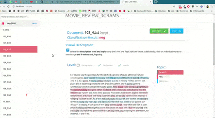
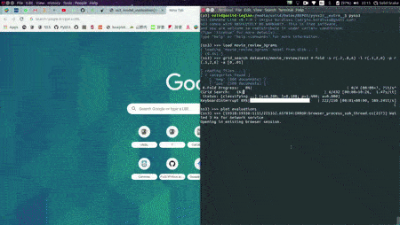

# PySS3: A python package implementing a novel text classifier with visualization tools for Explainable AI
[](http://pyss3.readthedocs.io/en/latest/?badge=latest)
[](https://travis-ci.org/sergioburdisso/pyss3)

The SS3 text classifier is a novel supervised machine learning model for text classification. SS3 was originally introduced in Section 3 of the paper _["A text classification framework for simple and effective early depression detection over social media streams"](https://dx.doi.org/10.1016/j.eswa.2019.05.023)_ (preprint available [here](https://arxiv.org/abs/1905.08772)).

**Some virtues of SS3:**

* It has the **ability to visually explain its rationale**.
* Introduces a **domain-independent** classification model that does not require feature engineering.
* Naturally supports **incremental (online) learning** and **incremental classification**.
* Well suited to work over **text streams**.

## What is PySS3?

PySS3 is a Python package that allows you to work with SS3 in a very straightforward, interactive and visual way. In addition to the implementations of the SS3 classifier, PySS3 comes with a set of tools to help you to develop your machine learning models in a clearer and faster way. These tools let you analyze, supervise and understand your models (what they have actually learned and why). To achieve this, PySS3 provides you 3 main components: the ``SS3`` class, the ``Server`` class and the ``PySS3 Command Line`` tool, as pointed out below.

### The `SS3` class

which implements the classifier using a clear API (very similar to that of `sklearn`):
````python
    from pyss3 import SS3
    clf = SS3()
    ...
    clf.fit(x_train, y_train)
    y_pred = clf.predict(x_test)
````

### The `Server` class

which allows you to interactively test your model and visually see the reasons behind classification decisions, **with just one line of code**:
```python
    import pyss3
    from pyss3 import SS3

    clf = SS3(name="my_model")
    ...
    clf.fit(x_train, y_train)
    pyss3.Server.serve(clf, x_test, y_test) # <- this one! cool uh? :)
```
As shown in the image below, this will open up, locally, an interactive tool in your browser which you can use to (live) test your models with the documents given in `x_test` (or typing in your own!). This will allow you to visualize and understand what your model is actually learning.



### And last but not least, the _PySS3 Command Line_

This is probably the most useful component of PySS3. When you install the package (for instance by using `pip install pyss3`) a new command line is automatically added to your environment, called _"pyss3"_. This command allows you to access to the _PySS3 Command Line_, an interactive command-line query tool. This tool will let you interact with your SS3 models through special commands while assisting you during the whole machine learning pipeline (model selection, training, testing, etc.). Probably one of the most important features is the ability to automatically (and permanently) record the history of every evaluation result of any type (tests, k-fold cross-validations, grid searches, etc.) that you've performed. This will allow you (with a single command) to interactively visualize and analyze your classifier performance in terms of its different hyper-parameters values (and select the best model according to your needs). For instance, let's perform a grid search with a 4-fold cross-validation on the three hyper-parameters, smoothness(`s`), significance(`l`), and sanction(`p`) as follows:

```console
your@user:/your/project/path$ pyss3
(pyss3) >>> load my_model
(pyss3) >>> grid_search path/to/dataset 4-fold -s r(.2,.8,6) -l r(.1,2,6) -p r(.5,2,6)
```
In this illustrative example, `s` will take 6 different values between .2 and .8, `l` between .1 and 2, and `p` between .5 and 2. After the grid search finishes, we can use the following command to open up the interactive plot in the browser:
```console
(pyss3) >>> plot evaluations
```


Each dot represents an experiment/evaluation performed using that particular combination of values (s, l, and p). Also, dots are painted proportional to how good the performance was using that configuration of the model. Researchers can interactively change the evaluation metrics to be used (accuracy, precision, recall, f1, etc.) and plots will update "on the fly". Additionally, when the cursor is moved over a data point, useful information is shown (including a "compact" representation of the confusion matrix obtained in that experiment). Finally, it is worth mentioning that, before showing the 3D plots, PySS3 creates a single and portable HTML file containing the plots and stores it locally. This allows researchers to store, send or upload the plots to another place using this single HTML file (their papers can now link to these types of plots to increase experimentation transparency!). For example, we have uploaded two of these files we've obtained for the "Tutorials" section: ["Movie Review Classification"](http://tworld.io/ss3/ss3_model_evaluation[movie_review_3grams].html) and ["Topic Categorization"](http://tworld.io/ss3/ss3_model_evaluation[topics_3grams].html) evaluation plots.


## The PySS3 Workflow

### The somewhat standard way

### The "Command-Line" way

## Installation


### PyPi installation

Simply type:
```console
$ pip install pyss3
```

### Installation from source

To install latest version from github, clone the source from the project repository and install with setup.py:
```console
$ git clone https://github.com/sergioburdisso/pyss3
$ cd pyss3
$ python setup.py install
 ```

## API Documentation


Full API documentation can be found [here](https://pyss3.readthedocs.io)
